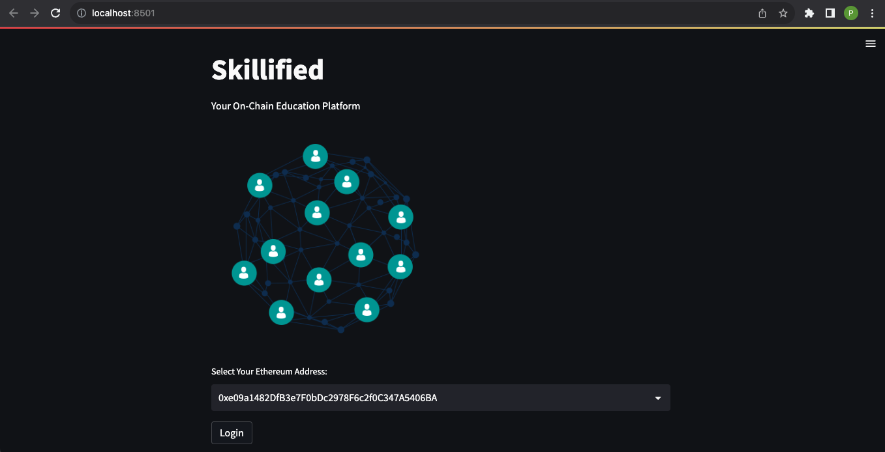
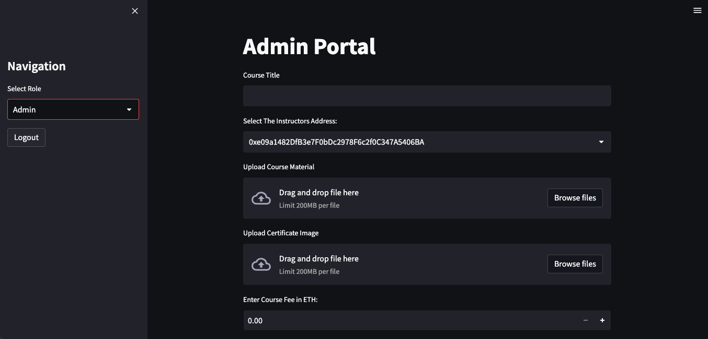
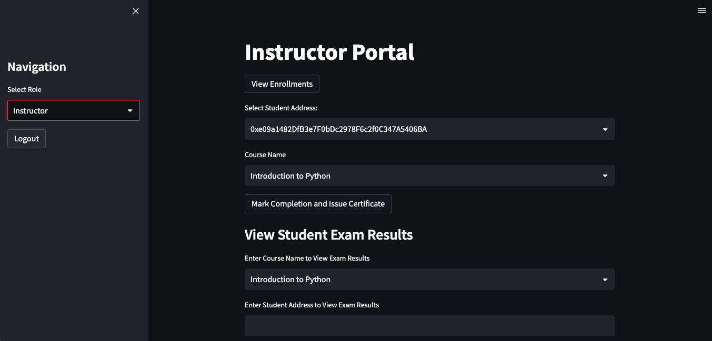
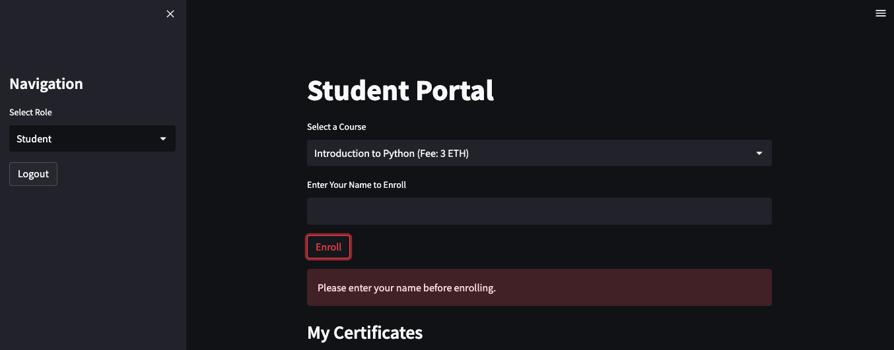
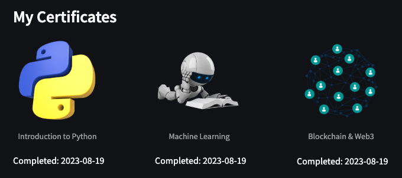
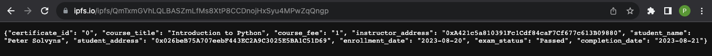

# Skillified: Your On-chain Education Platform

## Overview
Skillified is an on-chain education platform that facilitates the creation, enrollment, and certification of courses. By leveraging the Ethereum blockchain and IPFS, the platform ensures the integrity, transparency, and verifiability of educational achievements. The system is divided into three main user roles: **Admin**, **Instructor**, and **Student**. Each role has specific functions and capabilities to interact with the platform.

## Features
### Web3 Login Page
**How It Works**

1. **Select Ethereum Address**: Users are presented with a dropdown containing available Ethereum addresses. This selection simulates the process of connecting a Web3 wallet.

2. **Login Button**: Upon selecting an address, users can click the "Login" button to access the platform.

3. **Role Selection**: After logging in, users are directed to a navigation sidebar where they can select their role as Admin, Instructor, or Student. Each role provides unique functionalities and access within the platform.

4. **Logout Functionality**: A logout button in the navigation sidebar allows users to log out, returning them to the main page. This makes it possible to select a different account or simply exit the application.

5. **Session Management**: The login and logout functionalities are supported by Streamlit's session state management, ensuring that user selections and actions are preserved across different parts of the application.

### Benefits
- **Enhanced User Experience**: The login page provides an intuitive and familiar experience, aligning with typical decentralised applications.

- **Role-Based Access**: By allowing users to select roles, the platform can tailor the experience and features available to each user type.

- **Flexibility**: The login page serves as a gateway to the platform, allowing easy navigation and control over user interactions.
---
### Admin Portal

- **Create Courses**: Define course titles, instructors, associated material (via IPFS), exams, and fees.

- **Upload Materials**: Upload course content and certificate images to IPFS.

- **Progress Bar**: A progress bar to provide feedback to the user while uploading files to IPFS and creating the course.

- **Error Handling**: All fields are required to create a course and courses cannot be duplicated.
---
### Instructor Portal

- **View Enrollments**: Access student enrollment details, including names, addresses, enrollment dates, exam statuses, and completion dates.

- **Mark Completion & Issue Certificate**: Instructors can mark a course as completed and issue a certificate. This involves creating metadata and pinning it to IPFS.

- **Error Handling**: The Instructor portal incorporates multiple error handlers, such as checking for valid student addresses.
---
### Student Portal

- **Enroll in Courses**: Browse available courses, enroll by paying the required fee, and provide a name for certification.

- **Access Course Material**: Access course material hosted on IPFS.

- **Take Exams**: Participate in exams to demonstrate competence.

- **Error Handling**: Students are prompted they must enter a name prior to enrolling. Once the Student has passed the exam the Student cannot enroll in the same course again.

- **View Certificates**: View and access certificates of completed courses.

## My Certificates
Once the user has enrolled and viewed the course material they are prompted to take the exam, which is 10 multiple choice questions that directly correspond to the course material. Once the student has submitted their exam the result is recorded on chain and if the student has passed the exam a certificate of completion for the course is issued & displays in the student portal under the "My Certificates" title.

## Metadata Ipfs Hash
The data contained within the metadata Ipfs hash is stored off chain for easy access and verification from third parties.

It includes:
1. `certificate_id`
2. `course_title`
3. `course_fee`
4. `instructor_address`
5. `student_name`
6. `student_address`
7. `enrollment_date`
8. `exam_status`
9. `completion_date`

## Smart Contract Structure
The LearningPlatform smart contract is underpinned by Solidity and utilises ERC721Enumerable for certificate issuance.

The contract enables the platform to provide a comprehensive solution for online education, integrating course management, student enrollment, certificate issuance, and examination functionalities within a decentralised environment. By leveraging blockchain technology and IPFS, it ensures the integrity, transparency, and verifiability of educational credentials.

**Key Structures**:
1. **Course**:
Contains information about the course such as:

- `id`: The unique identifier for the course.
- `title`: The title of the course.
- `instructor`: The Ethereum address of the instructor.
- `ipfsHash`: The IPFS hash for the course material.
- `examTitle`: The title of the exam associated with the course.
- `certificateIpfsHash`: The IPFS hash for the certificate image.
- `isActive`: A boolean representing whether the course is active.
- `fee`: The enrollment fee for the course.

2. **Enrollment**:

Records details about student enrollments, including:

- `courseId`: The ID of the course.
- `student`: The Ethereum address of the student.
- `studentName`: The name of the student.
- `isCompleted`: A boolean indicating whether the course is completed.
- `enrollmentDate`: The timestamp of enrollment.

3. **Certificate**:

Details the certificate issued to a student, including:

- `certificateIpfsHash`: The IPFS hash of the certificate image.
- `metadataIpfsHash`: The IPFS hash of the certificate metadata.
- `completionDate`: The timestamp of course completion.

4. **ExamResult**:

Records the exam results for students, including:

- `courseId`: The ID of the course.
- `student`: The Ethereum address of the student.
- `isPassed`: A boolean indicating whether the student passed the exam.
- `passedTimestamp`: The timestamp when the student passed the exam.

### Key Functions:
**Course Management**:
- Creation of new courses.
- Verification of course availability and fee.

**Enrollment Management**:

- Enrollment in courses.
- Retrieval of enrollments for specific students.
- Tracking student addresses and enrollments.

**Certificate Management**:

- Issuance of certificates upon course completion or passing an exam.
- Retrieval of specific certificates.
- Token URI management for linking to IPFS certificate content.

**Exam Management**:

- Recording of exam results for specific courses.
- Retrieval of completion dates for specific courses and students.

**Ownership Management**:

- The contract has an owner who has special permissions, such as creating courses.

**NFT Functionality**:

- The contract utilises ERC721Enumerable to handle the minting and management of certificates as NFTs.

## Dependencies
- **[Solidity](https://soliditylang.org/) ^0.8.1**: For smart contract development.

- **[OpenZeppelin](https://www.openzeppelin.com/)**: Utilised for the ERC721Enumerable extension.

- **[Web3](https://pypi.org/project/web3/)**: For interacting with the Ethereum blockchain.

- **[Streamlit](https://streamlit.io/)**: For building the front-end interface.

- **[IPFS](https://docs.ipfs.tech/concepts/what-is-ipfs/)**: For decentralised storage of course materials and certificates.

- **[Pinata](https://www.pinata.cloud/)**: For pinning files to IPFS.

## Setup
1. **Compile the Contract**: Compile the Solidity contract in the appropriate environment.

2. **Configure Environment Variables**: Set up .env file with WEB3_RPC, SMART_CONTRACT_ADDRESS, PINATA_API_KEY, and PINATA_SECRET_API_KEY.

3. **Connect to Ethereum Network**: Ensure that the provided RPC URL in the environment variables is accessible.

4. **Run the Application**: Start the Streamlit application.

## Conclusion
Skillified is a novel approach to education that leverages blockchain technology to bring transparency and authenticity to the learning process. By certifying skills on-chain, it opens new opportunities for learners and educators, promoting trust and collaboration in the educational ecosystem.