# Skillified: Your On-Chain Education & Skills Verification Platform

## Introduction
Skillified is a pioneering decentralised, on-chain education platform that transforms the educational landscape by revolutionising the way students learn, instructors teach, and achievements are recognised. Leveraging the state-of-the-art capabilities of blockchain technology and IPFS, Skillified creates a seamless, transparent, and secure environment for course creation, enrollment, examination, and certification. This document serves as a comprehensive guide, detailing the platform's innovative features, intricate smart contract structure, vital dependencies, and streamlined setup instructions. Welcome to the future of education – welcome to Skillified.

## Overview
Skillified is more than just an education platform, it is a holistic educational ecosystem that seamlessly integrates with the Ethereum blockchain and IPFS to bring trust, integrity, and innovation to learning. The platform is ingeniously designed to facilitate the creation, enrollment, and certification of various courses, ensuring an unparalleled level of integrity, transparency, and verifiability of educational achievements.

The functionality of Skillified is orchestrated through three main user roles: **Admin**, **Instructor**, and **Student**, each designed to serve specific purposes and interactions within the platform:

- **Admin**: Oversees and manages the entire platform, including course creation and content management.

- **Instructor**: Imparts knowledge and skills through courses, supervises student progress, and certifies achievements.

- **Student**: Enrolls in courses, accesses learning materials, takes exams, and earns verifiable certificates.

Skillified's integration with Ethereum and IPFS not only brings credibility to educational credentials but also opens up new pathways in the world of digital learning. Join us on this journey towards a decentralised and authenticated education system.

## Features
### Web3 Login Page
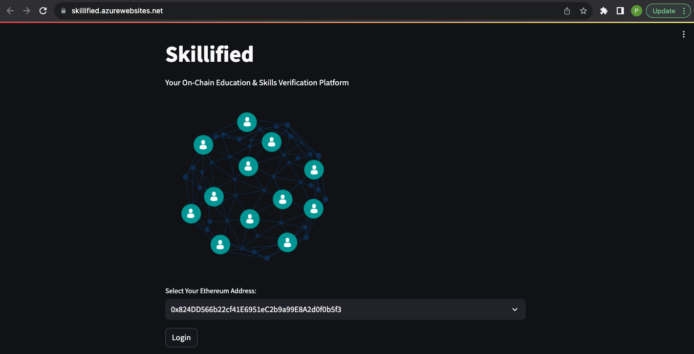
**How It Works**

1. **Select Ethereum Address**: Users are presented with a dropdown containing available Ethereum addresses. This selection simulates the process of connecting a Web3 wallet.

2. **Login Button**: Upon selecting an address, users can click the "Login" button to access the platform.

### Sidebar Navigation
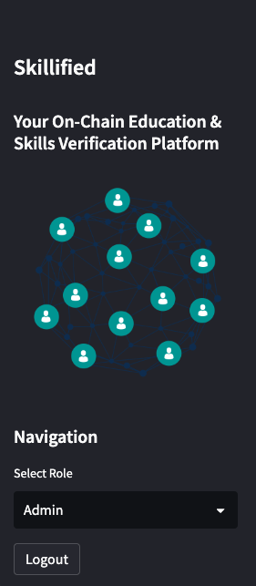

3. **Role Selection**: After logging in, users are directed to a navigation sidebar where they can select their role as **Admin**, **Instructor**, or **Student**. Each role provides unique functionalities and access within the platform.

4. **Logout Functionality**: A logout button in the navigation sidebar allows users to log out, returning them to the main page. This makes it possible to select a different account or simply exit the application.

5. **Session Management**: The login and logout functionalities are supported by Streamlit's session state management, ensuring that user selections and actions are preserved across different parts of the application.

### Benefits
- **Enhanced User Experience**: The login page and sidebar navigation provide an intuitive and familiar experience, aligning with typical decentralised applications.

- **Role-Based Access**: By allowing users to select roles, the platform can tailor the experience and features available to each user type.

- **Flexibility**: The login page serves as a gateway to the platform, allowing easy navigation and control over user interactions.
---

### Admin Portal
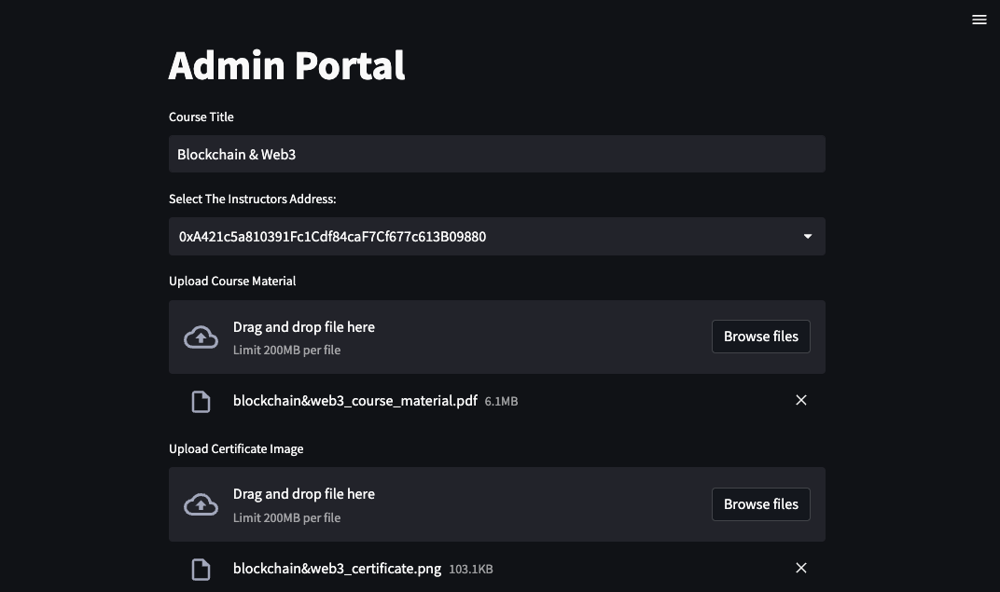
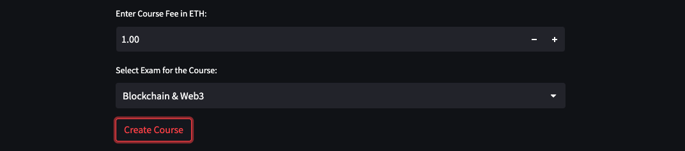

- **Create Courses**: Define course titles, instructors, associated material (via IPFS), exams, and fees.

- **Upload Materials**: Upload course content and certificate images to IPFS.

- **Progress Bar**: A progress bar to provide feedback to the user while uploading files and creating the course.

- **Error Handling**: All fields are required to create a course and courses cannot be duplicated.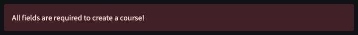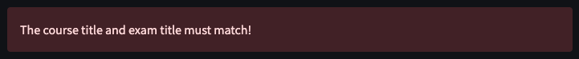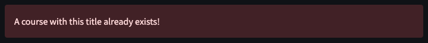
---
### Instructor Portal
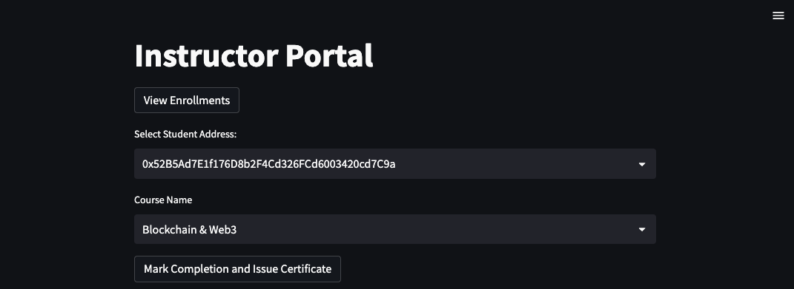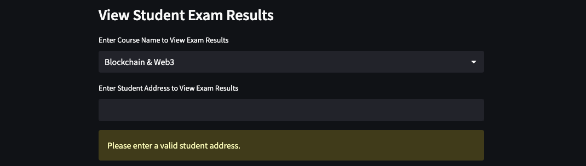

- **View Enrollments**: Access student enrollment details, including names, addresses, enrollment dates, exam statuses, and completion dates.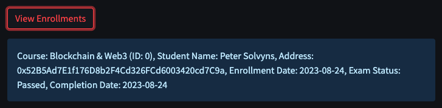

- **Mark Completion & Issue Certificate**: Instructors can mark a course as completed and issue a certificate.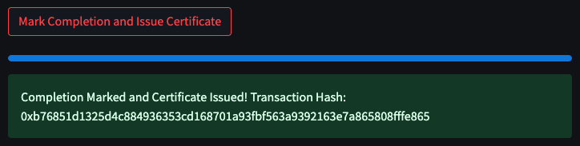

- **Error Handling**: The Instructor portal incorporates multiple error handlers.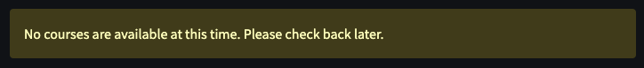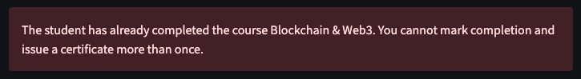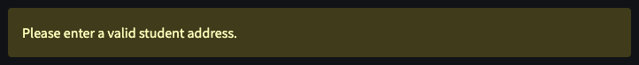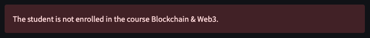
---
### Student Portal
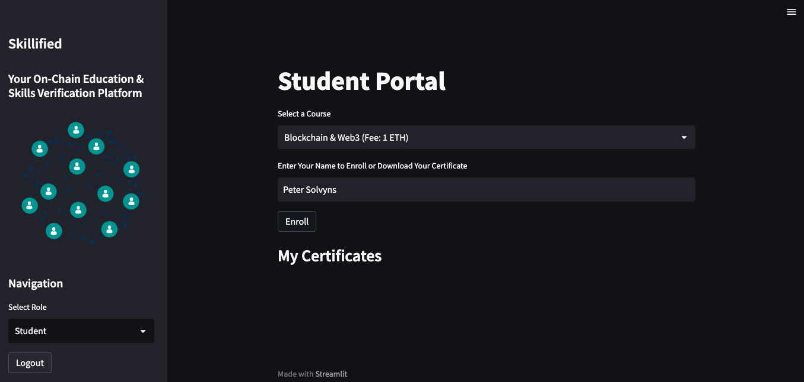
- **Enroll in Courses**: Browse available courses, enroll by paying the required fee, and provide a name for certification.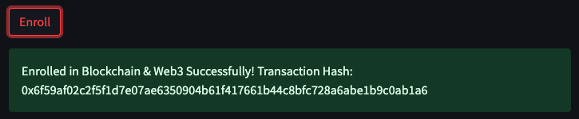

- **Access Course Material**: Access course material hosted on IPFS.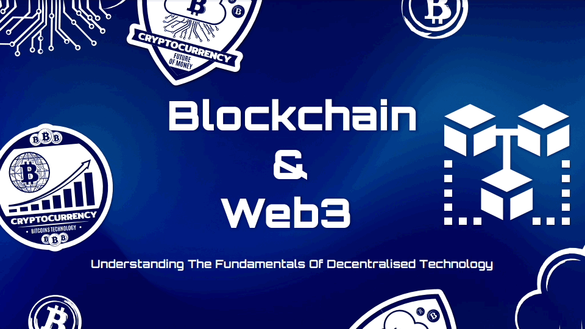

- **Take Exams**: Participate in exams to demonstrate competence.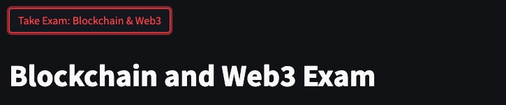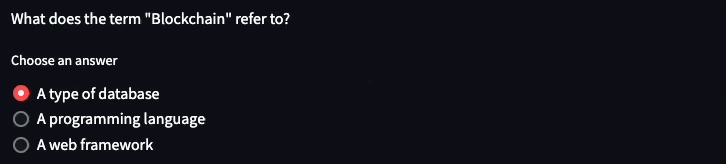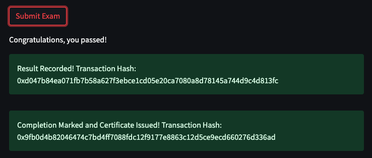

- **Error Handling**: The Student Portal incorporates multiple error handlers and warnings.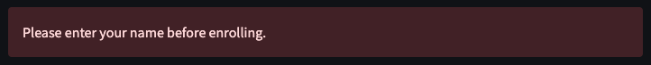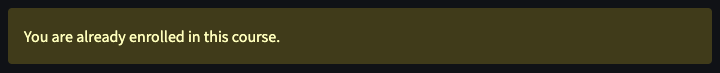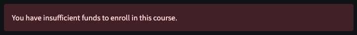

- **View Certificates**: View and download certificates of completed courses.

## My Certificates
Once the student has enrolled and viewed the course material they are prompted to take the exam, which is 10 multiple choice questions that directly correspond to the course material. Once the student has submitted their exam the result is recorded on chain and if the student has passed the exam a certificate of completion for the course is issued & displays in the student portal under the "My Certificates" title. The student then has the option to download the certificate as a PDF.

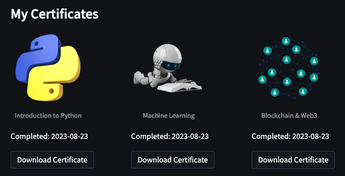

## Exams
Skillified provides a robust examination system that aligns with the courses offered, ensuring a comprehensive assessment of a student's understanding and skills. Here's how the examination process is designed and executed within the platform:

**Exam Creation**:
- **Admin Role**: The platform's admin is responsible for defining the exams associated with each course. This includes specifying the title of the exam and linking it to the corresponding course.

- **Question Structure**: Each exam consists of multiple-choice questions that are directly related to the course material. Questions are structured with a clear query, a set of options, and a correct answer index.

- **Inclusion in Course**: The exams are an integral part of the courses and are accessible to students after enrollment.

**Conducting Exams**:
- **Student Interaction**: Students can take the exams through an intuitive interface that displays the questions and allows selection of answers.

- **Answer Collection**: Student answers are collected during the exam, allowing for immediate evaluation.

- **Result Evaluation**: The system evaluates the student's responses by comparing them with the correct answers defined in the question structure.

**Recording Results on Blockchain**:
- **Transaction Creation**: Upon submitting the exam, a transaction is created to record the result on the blockchain.

- **Pass/Fail Determination**: The system determines whether the student has passed or failed based on the correct answers.

- **Blockchain Entry**: The result, along with relevant details such as course ID and pass/fail status, is recorded on the blockchain, ensuring transparency and immutability of the exam outcome.

## Metadata Creation
The data contained within the metadata Ipfs hash is stored off chain for easy access and verification from third parties.
Metadata associated with the certificate includes vital information like certificate ID, course title, course fee, instructor address, student details, enrollment date, exam status, and completion date.

It includes:
1. `certificate_id`
2. `course_title`
3. `course_fee`
4. `instructor_address`
5. `student_name`
6. `student_address`
7. `enrollment_date`
8. `exam_status`
9. `completion_date`

**JSON Format**: The metadata is structured in JSON format, allowing for easy parsing and accessibility.
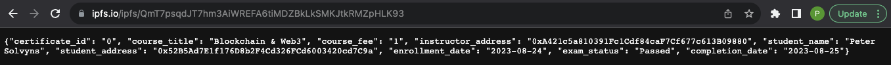
**Pinning to IPFS**:
- **File Pinning**: The certificate metadata is pinned to IPFS, a decentralised storage system.
- **IPFS Hash**: The unique IPFS hash ensures the availability and integrity of the certificate and metadata, allowing for verifiable access from anywhere.

- **Integration with Smart Contract**: The IPFS hash is integrated with the corresponding smart contract, linking the certificate to the on-chain record.

## Certificate Generation and Download
Upon successful completion of a course and passing the associated exam, students are awarded a certificate. The certificate generation and download process is a blend of technology and aesthetics, ensuring a meaningful representation of the student's achievement.

**PDF Generation**:
- **Certificate Template**: A certificate image serves as the background for the PDF, enhancing its visual appeal.

- **Custom Information**: The PDF includes personalised details such as the student's name, course title, and completion date, formatted with custom styles.

- **File Creation**: The certificate is generated as a downloadable PDF file, available directly from the platform.

The certificate generation and download features not only bring elegance to the certification process but also instill confidence and credibility through their integration with blockchain technology and IPFS.

By encapsulating the complete life cycle of exams and certificates within a secure and transparent environment, Skillified stands as a symbol of innovation in education, setting new standards for assessment and recognition of learning.

## Smart Contract Structure
The Skillified `LearningPlatform` smart contract is underpinned by Solidity and utilises ERC721Enumerable for certificate issuance.

The contract enables the platform to provide a comprehensive solution for online education, integrating course management, student enrollment, certificate issuance, and examination functionalities within a decentralised environment. By leveraging blockchain technology and IPFS, it ensures the integrity, transparency, and verifiability of educational credentials.

**Key Structures**:
1. **Course**:

Contains information about the course such as:

- `id`: The unique identifier for the course.
- `title`: The title of the course.
- `instructor`: The Ethereum address of the instructor.
- `ipfsHash`: The IPFS hash for the course material.
- `examTitle`: The title of the exam associated with the course.
- `certificateIpfsHash`: The IPFS hash for the certificate image.
- `isActive`: A boolean representing whether the course is active.
- `fee`: The enrollment fee for the course.

2. **Enrollment**:

Records details about student enrollments, including:

- `courseId`: The ID of the course.
- `student`: The Ethereum address of the student.
- `studentName`: The name of the student.
- `isCompleted`: A boolean indicating whether the course is completed.
- `enrollmentDate`: The timestamp of enrollment.

3. **Certificate**:

Details the certificate issued to a student, including:

- `certificateIpfsHash`: The IPFS hash of the certificate image.
- `metadataIpfsHash`: The IPFS hash of the certificate metadata.
- `completionDate`: The timestamp of course completion.

4. **ExamResult**:

Records the exam results for students, including:

- `courseId`: The ID of the course.
- `student`: The Ethereum address of the student.
- `isPassed`: A boolean indicating whether the student passed the exam.
- `passedTimestamp`: The timestamp when the student passed the exam.

### Key Functions:
**Course Management**:
- Creation of new courses.
- Verification of course availability and fee.

**Enrollment Management**:

- Enrollment in courses.
- Retrieval of enrollments for specific students.
- Tracking student addresses and enrollments.

**Certificate Management**:

- Issuance of certificates upon course completion or passing an exam.
- Retrieval of specific certificates.
- Token URI management for linking to IPFS certificate content.

**Exam Management**:

- Recording of exam results for specific courses.
- Retrieval of completion dates for specific courses and students.

**NFT Functionality**:

- The contract utilises ERC721Enumerable to handle the minting and management of certificates as NFTs.

## Dependencies
- **[OS](https://docs.python.org/3/library/os.html)**: Standard library for interacting with the operating system.

- **[JSON](https://www.json.org/json-en.html)**: For handling JSON data structure in metadata creation.

- **[Requests](https://docs.python-requests.org/en/latest/)**: For making HTTP requests to interact with external services like Pinata.

- **[Web3](https://pypi.org/project/web3/)**: For interacting with the Ethereum blockchain.

- **[Streamlit](https://streamlit.io/)**: For building the front-end interface.

- **[Datetime](https://docs.python.org/3/library/datetime.html)**: Standard library for working with dates and times.

- **[Dotenv](https://pypi.org/project/python-dotenv/)**: For loading environment variables from a .env file.

- **[ReportLab](https://www.reportlab.com/)**: For generating PDF certificates.

- **[Solidity](https://soliditylang.org/) ^0.8.1**: For smart contract development.

- **[OpenZeppelin](https://www.openzeppelin.com/)**: Utilised for the ERC721Enumerable extension.

- **[IPFS](https://docs.ipfs.tech/concepts/what-is-ipfs/)**: For decentralised storage of course materials and certificates.

- **[Pinata](https://www.pinata.cloud/)**: For pinning files to IPFS.

- **[Custom Modules]()**: Including exams, metadata, and download, which contain specific functionalities related to exams, metadata creation, and PDF generation.

## Setup
1. **Compile the Contract**: Compile the Solidity contract in the appropriate environment using a suitable compiler like Truffle or Remix.

2. **Deploy the Contract**: Deploy the compiled contract to the desired Ethereum network (local testnet, Ganache, etc.).

3. **Configure Environment Variables**: Set up a .env file with the necessary variables including WEB3_RPC, SMART_CONTRACT_ADDRESS, PINATA_API_KEY, and PINATA_SECRET_API_KEY.

4. **Install Python Dependencies**: Install necessary Python packages using pip, including Web3, Streamlit, Requests, and ReportLab.

5. **Connect to Ethereum Network**: Ensure that the provided RPC URL in the environment variables is accessible and the contract address is correctly set.

6. **Run the Application**: Start the Streamlit application using the appropriate command, `streamlit run skillified.py`

7. **Access the Platform**: Open the provided URL in a web browser to interact with the Skillified platform.

By following these steps, developers and users can set up the Skillified platform on their local environment, allowing them to explore and interact with the decentralised education system.

## Conclusion
Skillified represents the vanguard of educational innovation, seamlessly blending blockchain technology with the vibrant world of education. By anchoring academic achievements on-chain, Skillified adds a layer of transparency, authenticity, and verifiability that transcends traditional educational paradigms. It's not just a platform, it's a movement towards a decentralised educational future where students, instructors, and administrators engage in a trustful ecosystem. Through its diverse features, robust smart contract architecture, and user-centric design, Skillified invites everyone to partake in a journey that redefines education. Welcome to a future where learning is not just acquired but also verified, not just pursued but celebrated, and not just imparted but immortalised. Welcome to Skillified, where every skill is certified.


```markdown
Contributing

We welcome contributions to Skillified! If you would like to contribute, please follow these steps:

1. Fork the repository.
2. Create a new branch for your feature or fix.
3. Submit a pull request, and include a detailed description of your changes.

Please ensure that your code follows the existing style and that all tests pass.
```
## Contact
For any questions, suggestions, or feedback, please feel free to contact us at:

- **Email**: [support@skillified.com](mailto:support@skillified.com)
- **Website**: [www.skillified.com](https://www.skillified.com)


